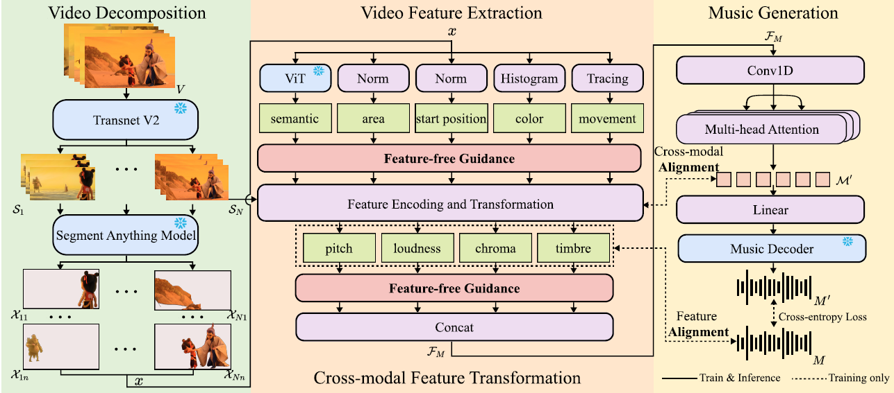

## Spatial-Temporal Decomposition and Alignment in Controllable Video-to-Music Generation

[[Paper](https://dl.acm.org/doi/abs/10.1145/3746027.3755523)]



This is the official repository for "Spatial-Temporal Decomposition and Alignment in Controllable Video-to-Music Generation" (ACM MM 25').
### 1. Example Data Input

./examples

### 2. Environment Preparation

Please first clone the repo and install the required environment, which can be done by running the following commands:

```
conda env create -n ControllableV2M python=3.9.0

conda activate ControllableV2M

cd ControllableV2M

pip install -r requirements.txt
```

If you find an error about torch and CuDNN during **training** or **inference**, please try "pip install torch==2.0.0 torchaudio==2.0.0 torchvision==0.15.1 xformers==0.0.17", but keep it like those in 'requirements.txt' during **data preprocessing**.
### 3. Data Preprocessing
* Dowmload SegGPT model from [SegGPT](https://huggingface.co/BAAI/SegGPT/blob/main/seggpt_vit_large.pth) and put it into './segment/SegGPT/SegGPT_inference' folder.
* Download SAM model from [SAM](https://dl.fbaipublicfiles.com/segment_anything/sam_vit_h_4b8939.pth) and put it into './segment/images' folder.
Please refer to ./data_process.py

### 4. Training

* Download MusicGen compression model from [MusicGen (small)](https://huggingface.co/facebook/musicgen-small) or [MusicGen (medium)](https://huggingface.co/facebook/musicgen-medium).
* Modify the config files
  There are some variables you **must** modify before your training. Other changes are optional.

  ```
  config/v2m.yaml path.video_path path/to/video_feature_input_folder
  config/v2m.yaml path.preprocessed_path path/to/music_feature_input_folder
  config/v2m.yaml path.music_target_path path/to/music_target_output_folder
  ```
* run training

  ```
  CUDA_VISIBLE_DEVICES=0 python train.py
  ```

### 5. Inference

* inference

```
python inference.py --model_path path/to/musicgen_compression_folder --v2m_checkpoint path/to/our/checkpoint --features_root path/to/video_feature_input_folder --video_control "0,0,color,1.5" --music_control "pitch,2.0"
```

Remember to change the number in Line 295 in 'inference.py' if you need to change the video input. video_feature_input_folder should be like './examples', and we have put one exapmle with number '0102_0011' which is the same as Line 295. Moreover, due to the overlap between shots, we recommend to set '--time_max' about 5 seconds more than the video/music duration you want, so that it would generate the music with the correct duartion.

### 6. Model weights

We will release the model weight soon.

### 7. Acknowledgements

you may refer to related work that serves as foundations for our framework and code repository, CLIP, MusicGen, SAM, SegGPT, Transnet-V2. Thanks for their wonderful works.

### 8. Citation
```
@inproceedings{you2025spatial,
  title={Spatial-Temporal Decomposition and Alignment in Controllable Video-to-Music Generation},
  author={You, Weitao and Zuo, Heda and Wu, Junxian and Zhang, Dengming and Zhou, Zhibin and Sun, Lingyun},
  booktitle={Proceedings of the 33rd ACM International Conference on Multimedia},
  pages={10278--10286},
  year={2025}
}
```
